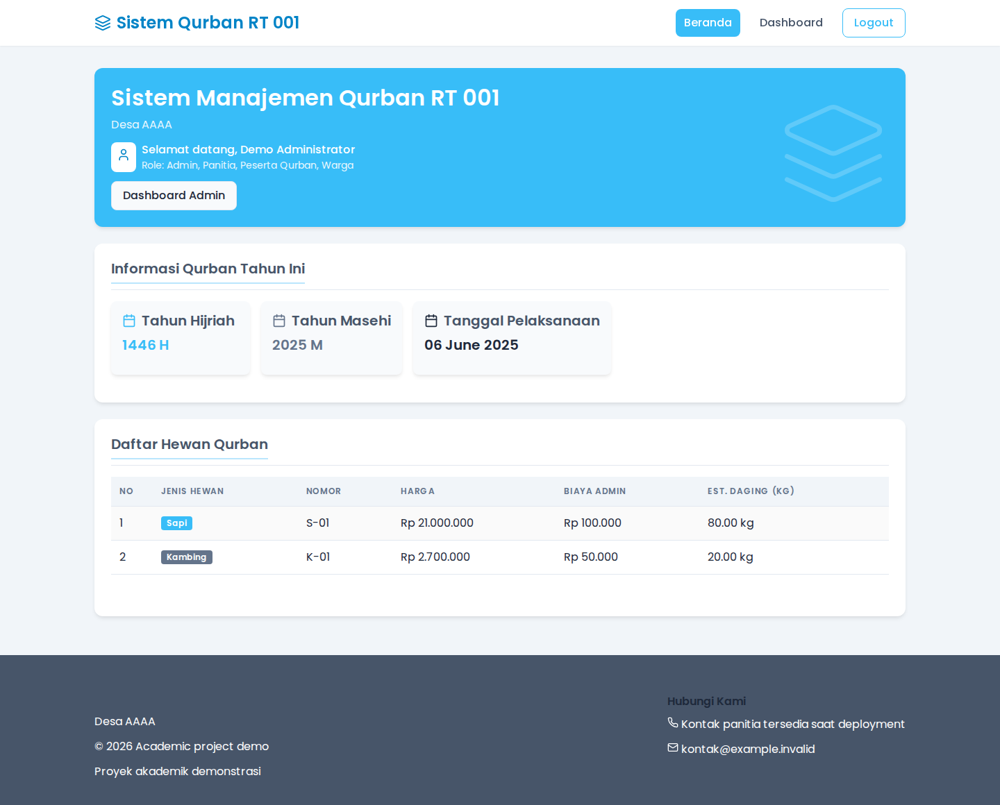
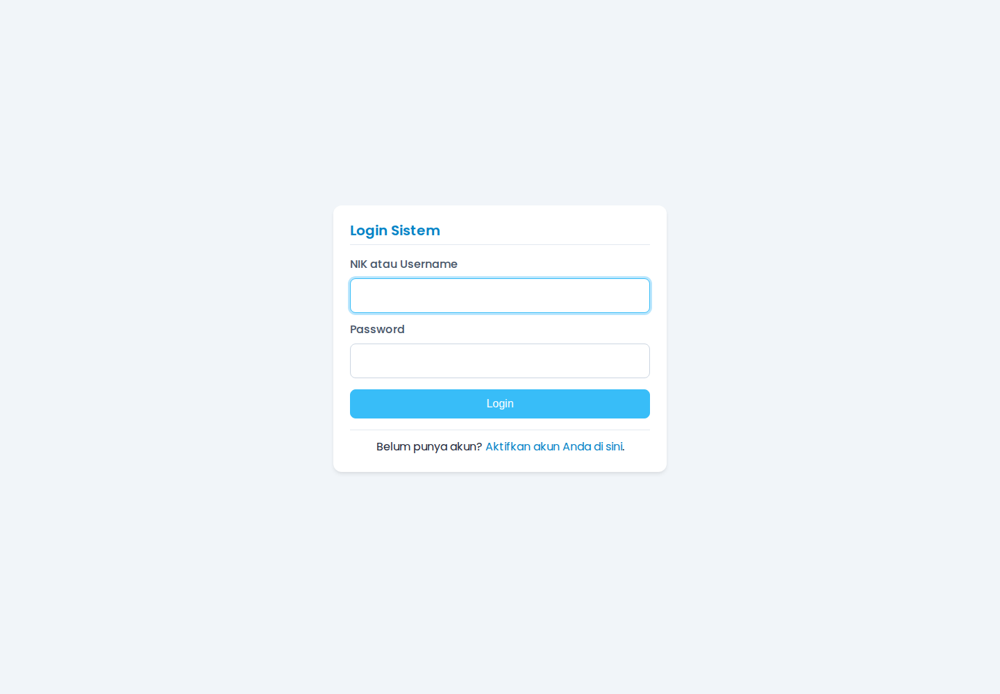
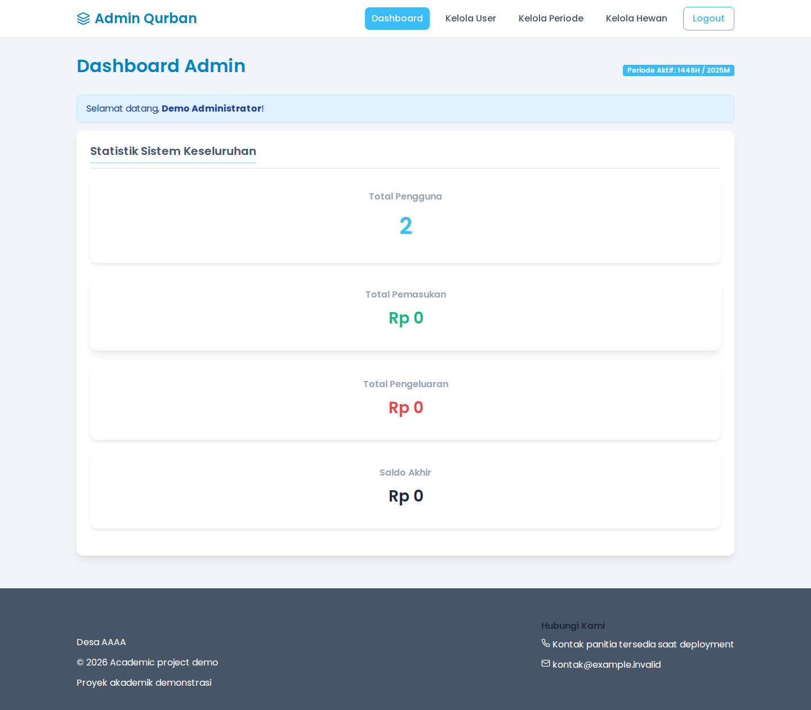
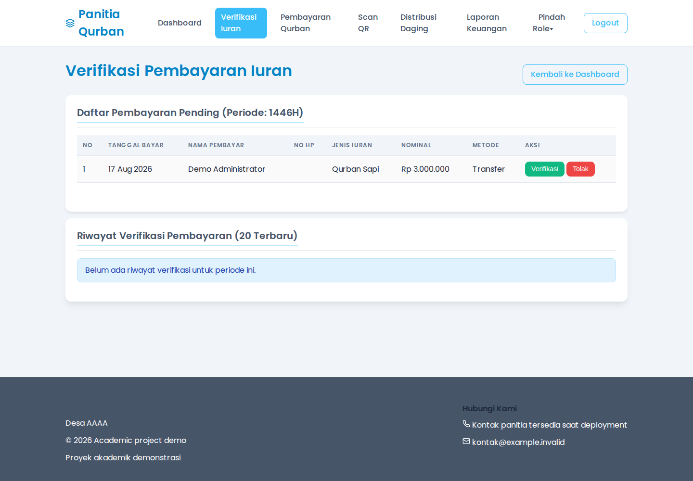
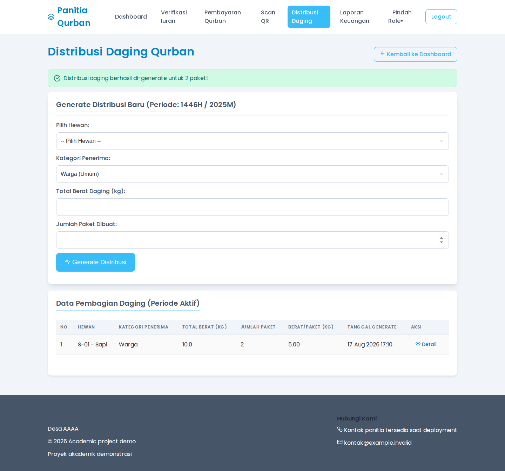
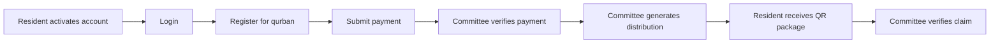

# Qurban Management System

A web-based academic project for managing qurban activities, including registration, payment verification, financial reporting, and meat distribution.




## Overview

The system provides separate workflows for administrators, committee members, residents, and qurban participants. It was rebuilt from an older academic project and verified locally with a clean demo database.

## Features

- Login using NIK or username.
- Role-based access for admin, committee, resident, and qurban participant accounts.
- Qurban period and animal management.
- Participant registration and payment recording.
- Payment verification by committee members.
- Income and expense tracking.
- Financial reports by qurban period.
- Meat package distribution generation.
- QR code-based package claim verification.
- Anonymous local demo data for safe testing.

## Screenshots

<p align="center">
  
  
</p>
<p align="center">
  
  
</p>

## Workflow



## Tech stack

- PHP 8.2+
- MySQL or MariaDB
- HTML, CSS, and vanilla JavaScript
- Docker Compose for local development

## Quick start with Docker Compose

The recommended way to run the project is Docker Compose:

```bash
docker compose up --build
```

Open `http://localhost:8000` in a browser.

If the default host port is already in use:

```bash
APP_PORT=18080 docker compose up --build
```

Then open `http://localhost:18080`.

To stop the application and remove the demo database volume:

```bash
docker compose down -v
```

## Local PHP setup

### 1. Create and import the database

```bash
mysql -u root -p -e "CREATE DATABASE db_qurban CHARACTER SET utf8mb4 COLLATE utf8mb4_unicode_ci;"
mysql -u root -p db_qurban < db_qurban.sql
```

### 2. Configure environment variables

The application reads database settings from environment variables. Start from [`.env.example`](.env.example):

```bash
export DB_HOST=127.0.0.1
export DB_PORT=3306
export DB_DATABASE=db_qurban
export DB_USERNAME=qurban
export DB_PASSWORD='change-this-locally'
```

Do not commit `.env` files or real credentials.

### 3. Start PHP

```bash
php -S 127.0.0.1:8000 -t .
```

## Demo accounts

The database dump contains local-only demo accounts:

| Username | Password | Role |
| --- | --- | --- |
| `demo_admin` | `demo-password` | All application roles |
| `demo_warga` | `demo-password` | Resident |

These credentials are intended only for local testing. Change or remove them before any real deployment.

## Validation

The current release was verified with:

- PHP syntax checks across the application.
- Clean MariaDB schema and seed import.
- Authenticated crawl of 27 PHP routes with no runtime errors.
- End-to-end checks for login, payments, verification, participant registration, transactions, distribution, and QR claims.
- Docker Compose startup and browser smoke tests.

See the detailed [QA report](docs/qa-report.md).

## Security and limitations

- Database credentials are supplied through environment variables rather than source code.
- The included database seed contains anonymous demo data only.
- Demo credentials must not be used in production.
- QR image rendering currently uses an external QR generation service.
- CSRF protection, automated browser tests, and production deployment configuration are future improvements.
