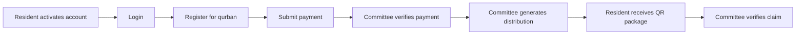

# Qurban Management System

A role-based web application for managing community qurban workflows, from participant registration and payment verification to financial reporting and meat distribution.


## Overview

Originally developed as an academic project, this version was rebuilt and hardened as a locally verifiable demo with anonymous data. It provides separate workflows for administrators, committee members, residents, and qurban participants.

## Features

- Login using NIK or username.
- Role-based access for admin, committee, resident, and qurban participant accounts.
- Qurban period and animal management.
- Participant registration and payment recording.
- Payment verification by committee members.
- Income and expense tracking.
- Financial reports by qurban period.
- Meat package distribution generation.
- QR code and package-number claim verification.
- CSRF-protected state-changing forms and POST-only logout.
- Atomic payment verification and meat distribution generation.
- Anonymous local demo data for safe testing.

## Screenshots

<p align="center">
  
  
</p>
<p align="center">
  
  
</p>

The screenshots use the local anonymous demo database. Names, dates, and financial values shown in them are test data, not production records.

## Workflow



## Tech stack

- PHP 8.2+
- MySQL or MariaDB
- HTML, CSS, and vanilla JavaScript
- Docker Compose for local development

## Quick start with Docker Compose

The recommended way to run the project is Docker Compose:

```bash
docker compose up --build
```

Open `http://localhost:8000` in a browser.

If the default host port is already in use, set `APP_PORT`:

```bash
APP_PORT=18080 docker compose up --build
```

Then open `http://localhost:18080`.

To stop the application and remove the demo database volume:

```bash
docker compose down -v
```

## Local PHP setup

### 1. Create and import the database

```bash
mysql -u root -p -e "CREATE DATABASE db_qurban CHARACTER SET utf8mb4 COLLATE utf8mb4_unicode_ci;"
mysql -u root -p db_qurban < db_qurban.sql
```

### 2. Configure environment variables

The application reads database settings from environment variables. Start from [`.env.example`](.env.example):

```bash
export DB_HOST=127.0.0.1
export DB_PORT=3306
export DB_DATABASE=db_qurban
export DB_USERNAME=qurban
export DB_PASSWORD='change-this-locally'
```

Do not commit `.env` files or real credentials.

### 3. Start PHP

```bash
php -S 127.0.0.1:8000 -t .
```

## Demo accounts

The database dump contains local-only demo accounts:

| Username | Password | Role |
| --- | --- | --- |
| `demo_admin` | `demo-password` | All application roles |
| `demo_warga` | `demo-password` | Resident |

These credentials are intended only for local testing. Change or remove them before any real deployment.

## Validation

The latest local QA pass was completed on 2026-08-18 against the Docker Compose application and anonymous demo database:

- PHP syntax checks: `39/39` tracked PHP files passed.
- JavaScript syntax check: `src/js/main.js` passed.
- Authenticated route crawl: `23/23` application routes returned HTTP 200 without error markers.
- Regression and security suite: `20/20` assertions passed.
- Logout security suite: `7/7` assertions passed, including GET rejection and session invalidation after valid POST logout.
- Coverage included CSRF rejection, protected NIK lookup, period and animal validation, payment amount validation, atomic payment verification, atomic distribution generation, QR/package-number claims, duplicate-claim rejection, and database mutation checks.
- Browser smoke test passed for login, admin dashboard, homepage, payment verification, and distribution pages.
- Five full-page documentation screenshots were captured from the same QA runtime.
- Application logs after the final test run contained zero fatal errors, warnings, notices, MySQL errors, or undefined-function errors.

See the detailed [QA report](docs/qa-report.md).

## Security and limitations

- Database credentials are supplied through environment variables rather than source code.
- The included database seed contains anonymous demo data only.
- State-changing application forms use server-side CSRF validation; logout is POST-only.
- The NIK lookup endpoint requires an authenticated session.
- Payment verification and meat distribution generation use database transactions.
- Demo credentials must not be used in production.
- QR image rendering currently uses an external QR generation service.
- This repository is not a complete production deployment. HTTPS, production secret management, backups, monitoring, full penetration testing, aggressive concurrency testing, failure injection, and a complete upload-security review still require separate work before deployment.
